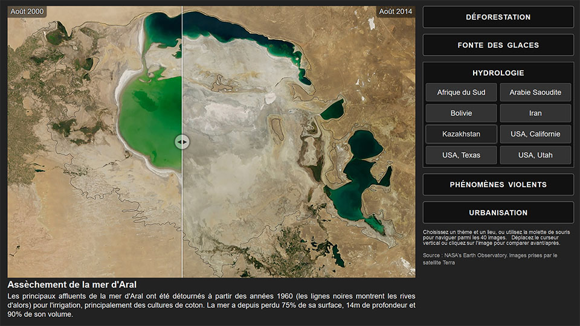

# VisuClimat
**Visualisez les changements environnementaux de la Terre : https://www.sendell.com/blog/visualisation-des-changements-environnementaux/**

VisuClimat permet de visualiser sur un écran tactile (1920×1080px) les évolutions environnementales de la Terre, en comparant aisément des images "avant" et "après" d'un même lieu, classées par thème, que ce soit sur des délais rapprochés (catastrophes naturelles) ou à plus long terme (déforestation), avec des phénomènes naturels (fonte des glaces) ou directement dus à l'activité humaine (urbanisation), en mêlant images satellitaires et photos *in situ*.

Démo : https://www.sendell.com/VisuClimat/VisuClimat.html
